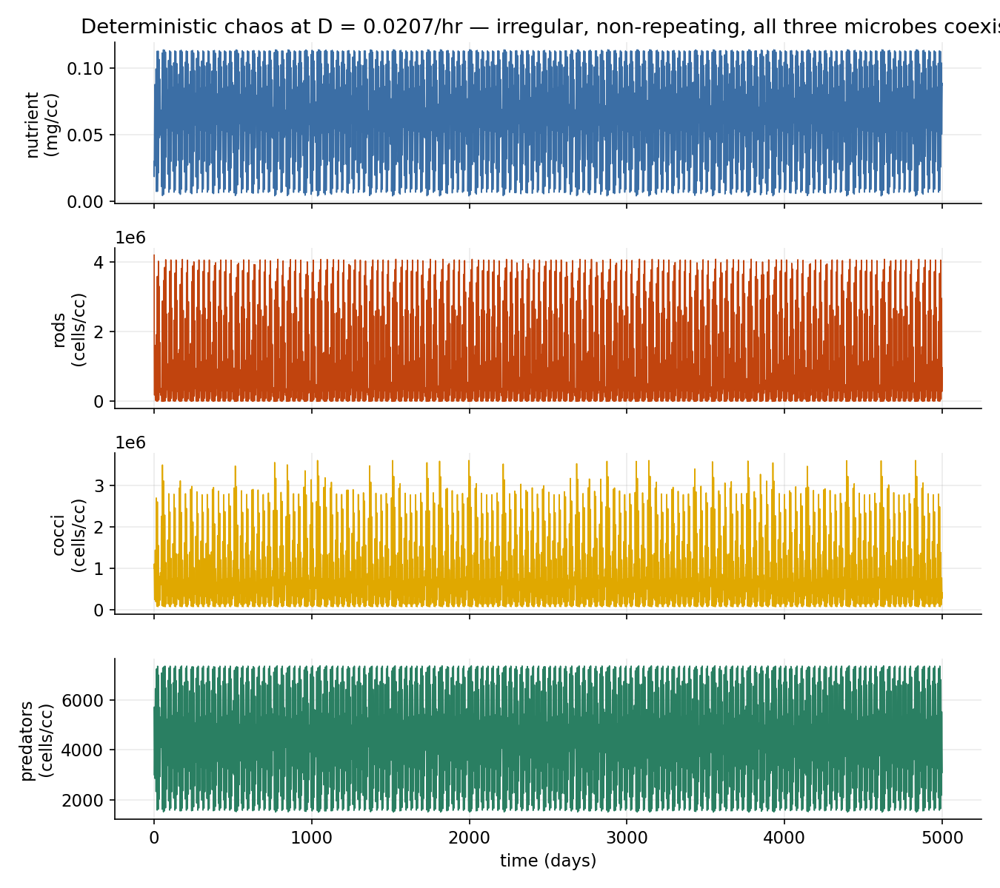
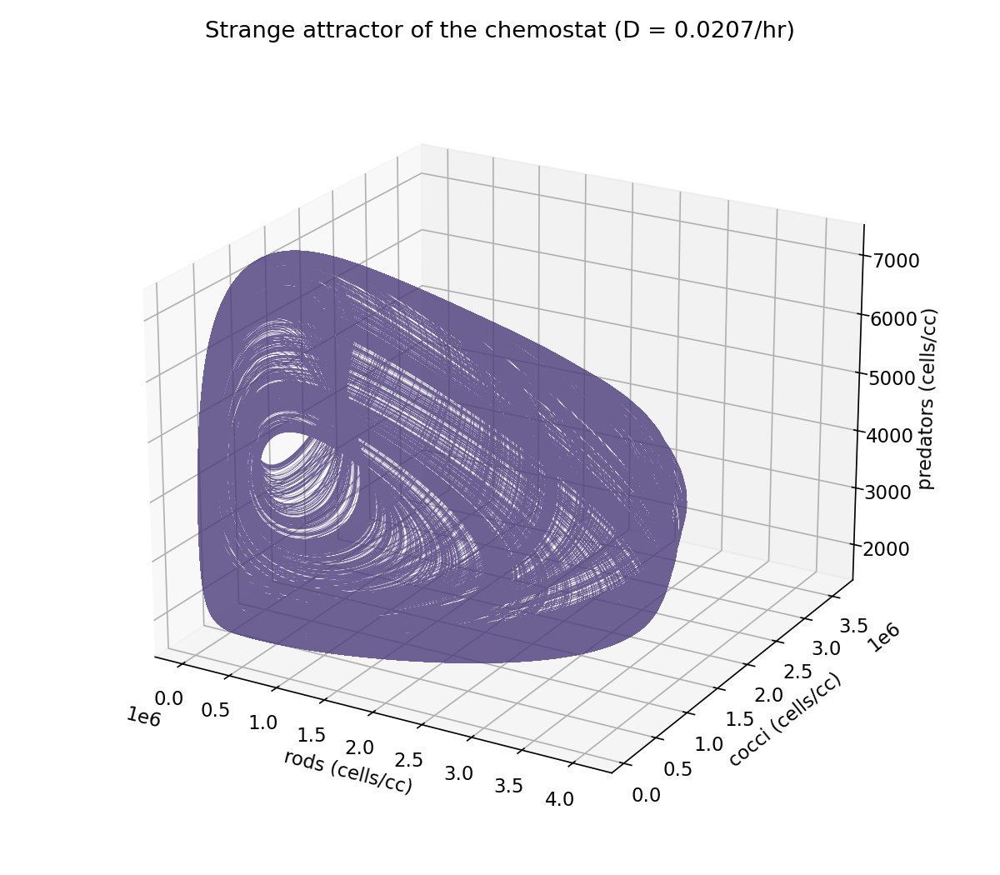
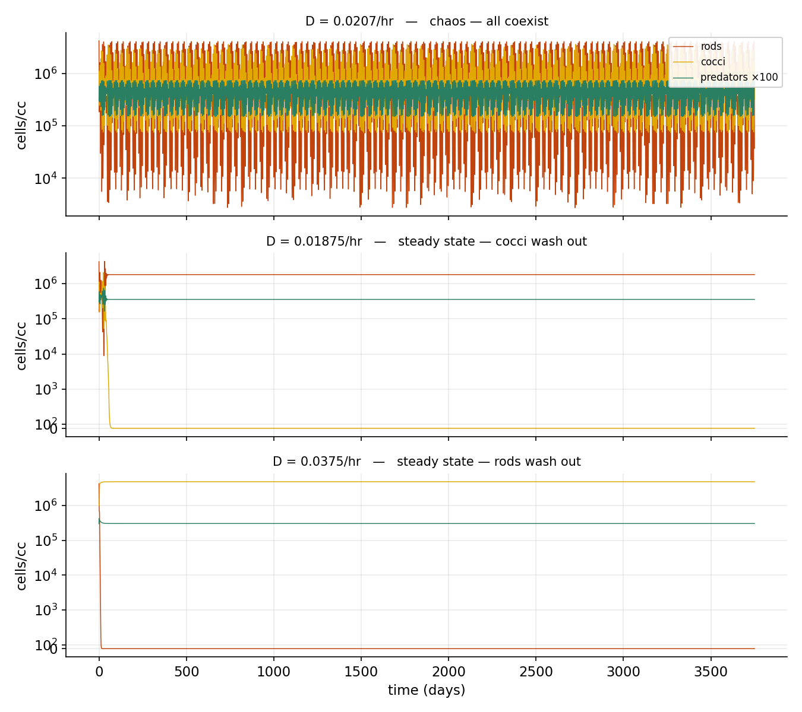
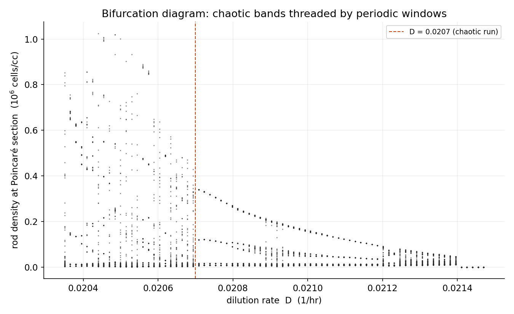
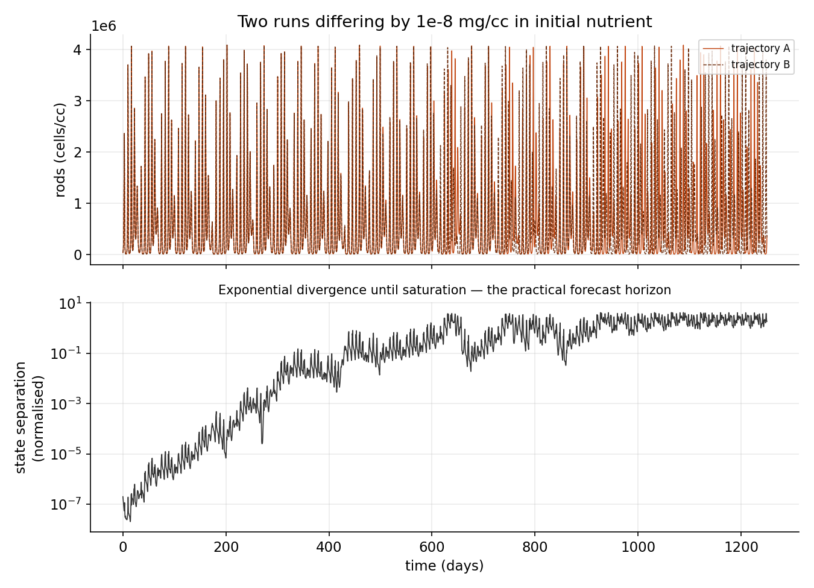
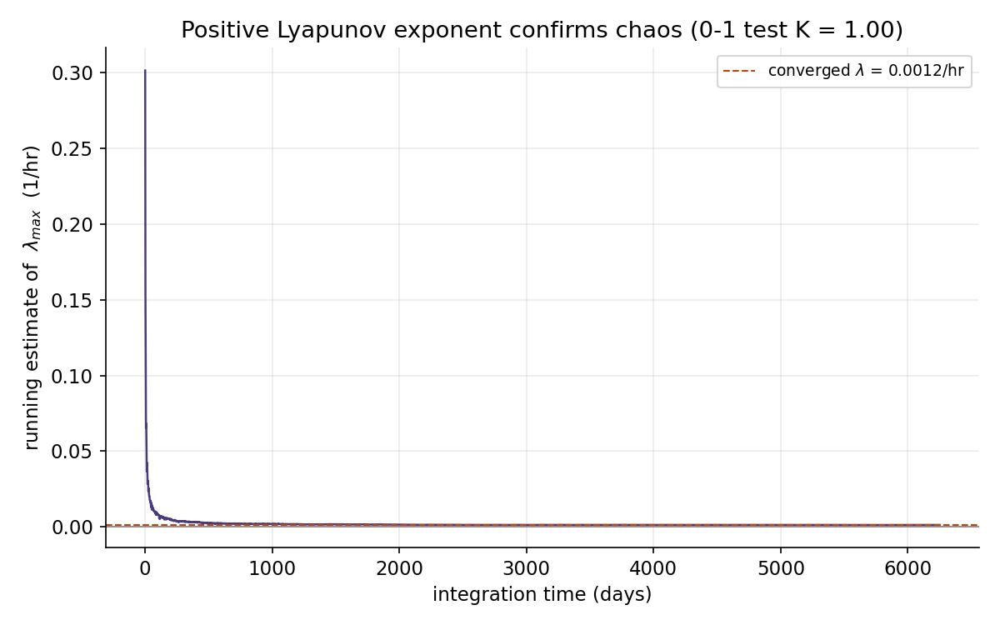

# Deterministic chaos in a four-component microbial chemostat

A small, self-contained simulation of the microbial food-web model of
**Molz, Faybishenko & Agarwal (2019)**, which reproduces the deterministic
chaos that Becks *et al.* (2005, *Nature*) measured in a real chemostat. The
code integrates the four coupled rate equations, shows that the coexistence
state is a strange attractor, and quantifies the chaos with a positive Lyapunov
exponent and the 0–1 test.

This repository is the first stage of a larger project on **forecasting chaotic
microbial dynamics with deep learning**. Before a network can be asked to
predict such a system, one needs a trustworthy source of chaotic trajectories
and an honest measure of how far ahead prediction is even possible. That is what
this code provides: the synthetic data generator and the predictability
yardstick. The forecasting models are the planned next stage (see
[Roadmap](#roadmap)).

## The system

Four state variables, all in a well-mixed vessel that is continuously fed fresh
nutrient at dilution rate `D` and drained at the same rate:

| symbol | meaning | role |
|--------|---------|------|
| `n` | nutrient concentration (mg/cc) | the limiting resource |
| `r` | rod bacteria (cells/cc) | strong competitor for nutrient |
| `c` | coccus bacteria (cells/cc) | weaker competitor, but less eaten |
| `p` | ciliate predator (cells/cc) | grazes on both, prefers rods |

The rods and cocci compete for the same nutrient while the predator eats both.
That three-way tension — competition between the two prey plus predation — is
enough to make the populations never settle down. Two extra ingredients tip the
merely-oscillating system into genuine chaos: the predator's preference for rods
**strengthens as rods become more abundant**, and a fraction of dead predator
biomass is **recycled back into nutrient**.

### Equations

Growth follows Monod (Michaelis–Menten) kinetics. Cell counts are converted to
biomass through mean cell masses `m_r, m_c, m_p` so that the nutrient budget
balances. This is Eq. (1.10) of the LBNL report:

$$\frac{dn}{dt} = D(n_0 - n) - \frac{\mu_{rn}}{Y_{rn}}\frac{n}{K_{rn}+n}\,m_r r - \frac{\mu_{cn}}{Y_{cn}}\frac{n}{K_{cn}+n}\,m_c c + EF\,\delta_p\, m_p p$$

$$\frac{dr}{dt} = \mu_{rn}\frac{n}{K_{rn}+n}\,r - \frac{\mu_{pr}(m_1 r + i_1)}{Y_{pr}}\frac{m_r r}{K_{pr}+m_2 r + m_r r}\frac{m_p p}{m_r} - D r$$

$$\frac{dc}{dt} = \mu_{cn}\frac{n}{K_{cn}+n}\,c - \frac{\mu_{pc}}{Y_{pc}}\frac{m_c c}{K_{pc}+m_c c}\frac{m_p p}{m_c} - D c$$

$$\frac{dp}{dt} = \mu_{pr}(m_1 r + i_1)\frac{m_r r}{K_{pr}+m_2 r + m_r r}\,p + \mu_{pc}\frac{m_c c}{K_{pc}+m_c c}\,p - D p - \delta_p p$$

The `(m_1 r + i_1)` factor is the density-dependent rod preference; the
`+EF·δ_p·m_p·p` term is the nutrient recycling. All parameter values are from
Table 1.1 of the report and live in the `Params` dataclass in
[`src/chemostat.py`](src/chemostat.py).

## What the code shows

**The coexistence state is chaotic.** At `D = 0.0207 / hr` the three microbes
coexist forever but never repeat. The trajectory fills a strange attractor, and
two runs that start a hair apart drift completely out of step.





**The dilution rate selects the regime.** Lower it and the cocci wash out;
raise it and the rods wash out; only in between do all three persist — and there
the dynamics are chaotic. This matches the three cases reported in the paper.



**Chaos is threaded with periodic windows.** Sweeping `D` and recording the rod
density on a Poincaré section gives a bifurcation diagram with the familiar
route-to-chaos structure: broad chaotic bands interrupted by narrow windows
where the motion locks back onto a cycle. (The value `D = 0.0208` used in the
original experiment happens to fall in one such window in this reconstruction,
so the canonical chaotic run here uses the neighbouring `D = 0.0207`.)



**Predictability has a hard limit.** A perturbation of one part in `10⁸` grows
exponentially until it saturates at the size of the attractor. Beyond that
horizon the future is unknowable, no matter how good the model. This is exactly
what a forecaster has to fight against — and what sets the ceiling on how far it
can possibly see.



**Two independent chaos tests agree.** The largest Lyapunov exponent, computed
by propagating the tangent-linear equation, converges to a small **positive**
value; the 0–1 test returns `K ≈ 1`. Both are signatures of deterministic
chaos rather than noise or a long cycle.



Measured on the canonical run:

| quantity | value | meaning |
|----------|-------|---------|
| largest Lyapunov exponent `λ` | ≈ 0.0012 / hr | positive ⇒ chaos |
| Lyapunov time `1/λ` | ≈ 850 hr (~35 days) | timescale of predictability |
| 0–1 test statistic `K` | ≈ 0.99 | independent confirmation |

The Lyapunov exponent here is smaller than the values reported from the noisy
experimental time series (which were estimated with Rosenstein's method, known
to read high); the variational value computed from the equations themselves is
the cleaner number and is what sets the forecast horizon below.

## Running it

```bash
pip install -r requirements.txt
python run_all.py
```

This regenerates every figure into `figures/` and prints the diagnostics. It
takes a few minutes, most of it the bifurcation sweep. For an interactive
walk-through of the same results, open
[`notebook.ipynb`](notebook.ipynb).

To use the model directly:

```python
import sys; sys.path.insert(0, "src")
import chemostat as cm

t, Y = cm.simulate(cm.D_CHAOS, t_end=50_000)   # integrate the ODEs
lam  = cm.largest_lyapunov(cm.D_CHAOS)          # ~0.0012 /hr
K    = cm.zero_one_test(Y[1])                   # ~0.99
```

## Repository layout

```
src/chemostat.py   model, integrator, Lyapunov exponent, 0-1 test, Poincaré map
run_all.py         regenerates all six figures and prints diagnostics
notebook.ipynb     narrative walk-through of the same analysis
figures/           committed PNGs (so they render above)
```

## Roadmap

The point of a clean chaos generator with a known Lyapunov time is that it turns
"can we forecast this?" into a measurable question. Planned next stages:

1. **Data.** Use `simulate()` to build a library of trajectories across the
   chaotic band, at realistic sampling and with observational noise added.
2. **Forecasting.** Train and compare sequence models (a plain LSTM baseline
   against reservoir computing / echo-state networks, which are strong on
   chaotic series) to predict the multivariate state forward.
3. **Skill in the right units.** Report the forecast horizon in **Lyapunov
   times**, not seconds — the only fair way to score prediction of a chaotic
   system, since the Lyapunov time is the natural clock of its predictability.

## References

- F. Molz, B. Faybishenko, D. Agarwal (2019). *A Broad Exploration of Coupled
  Nonlinear Dynamics in Microbial Systems Motivated by Chemostat Experiments
  Producing Deterministic Chaos.* LBNL Report LBNL-2001172.
  <https://escholarship.org/uc/item/9wr5396s>
- L. Becks, F. Hilker, H. Malchow, K. Jürgens, H. Arndt (2005). *Experimental
  demonstration of chaos in a microbial food web.* Nature 435, 1226–1229.
- G. Gottwald, I. Melbourne (2004). *A new test for chaos in deterministic
  systems.* Proc. R. Soc. A 460, 603–611.

## License

Released under the MIT License — see [LICENSE](LICENSE).
